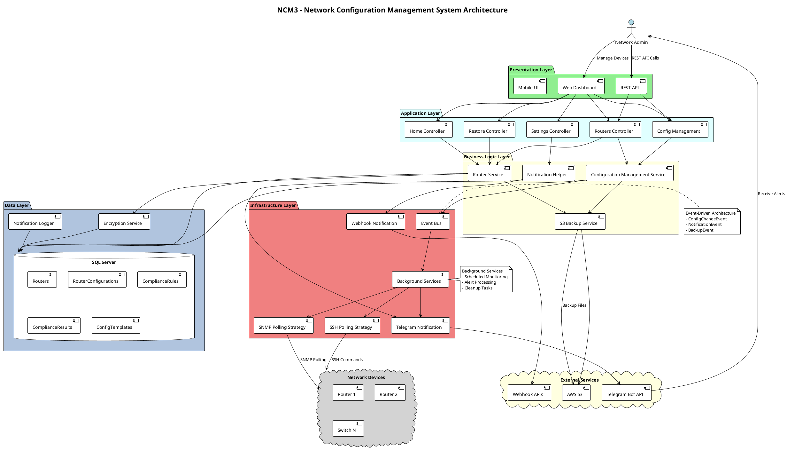

# NCM3 - Network Configuration Management System
## Ý tưởng Slide Trình bày Dự án

---

## **SLIDE 1: GIỚI THIỆU VẤN ĐỀ (3 phút)**

### **1️⃣ Vấn đề bạn muốn giải quyết là gì?**

**🔥 Pain Points trong Network Management:**
- **Manual Configuration Tracking**: 70% doanh nghiệp vẫn backup cấu hình manual
- **Downtime Risk**: Thiếu visibility về thay đổi cấu hình → outage không lường trước
- **Compliance Challenge**: Không có audit trail cho configuration changes
- **Recovery Time**: Khôi phục cấu hình mất hàng giờ khi có sự cố
- **Human Error**: 80% network downtime do lỗi cấu hình con người

**📊 Impact Statistics:**
- Network downtime: $5,600/phút cho enterprise
- Manual backup: 2-4 giờ/device/tháng
- Compliance audit: 40-80 giờ nhân công/năm

### **2️⃣ Tại sao bạn lại muốn xắn tay giải quyết nó?**

**💡 Động lực phát triển:**
- **Personal Experience**: Từng gặp sự cố mất cấu hình router quan trọng
- **Market Gap**: Solutions hiện tại quá đắt cho SME (Small-Medium Enterprise)
- **Technical Challenge**: Muốn build end-to-end solution với modern stack
- **Real Business Value**: Giải quyết vấn đề thực tế của network admin

**🎯 Vision:**
> "Democratize enterprise-grade network configuration management cho mọi quy mô doanh nghiệp"

### **3️⃣ Ai đã giải quyết nó và ưu nhược điểm?**

**🏢 Existing Solutions:**

| Solution | Ưu điểm | Nhược điểm | Giá |
|----------|---------|------------|-----|
| **SolarWinds NCM** | ✅ Full-featured ✅ Multi-vendor | ❌ $3,000+/năm❌ Complex setup
| **Cisco Prime** | ✅ Cisco native ✅ Deep integration | ❌ Vendor lock-in❌ Cisco only 
| **ManageEngine NCM** | ✅ Web-based ✅ Good reporting | ❌ $1,500+/năm❌ Limited customization 

**🎯 NCM3 Positioning:**
- **Cost**: 80% cheaper than commercial solutions
- **Simplicity**: 5-minute setup vs hours
- **Modern Tech**: Cloud-native, API-first
- **Flexibility**: Open source + commercial support option

---

## **SLIDE 2: KIẾN TRÚC HỆ THỐNG**

### **🏗️ System Architecture (PlantUML)**

### **🔧 Technology Stack Details:**

**Frontend Tier:**
- **ASP.NET Core MVC** - Server-side rendering
- **Bootstrap 5** - Responsive UI framework
- **Chart.js** - Real-time dashboards
- **jQuery** - DOM manipulation

**Backend Tier:**
- **C# .NET 8** - Core application logic
- **Entity Framework Core** - ORM layer
- **Dependency Injection** - IoC container
- **Background Services** - Long-running tasks

**Communication:**
- **SSH.NET** - Secure device connectivity
- **SnmpSharpNet** - SNMP operations
- **RESTful APIs** - External integrations
- **Event Bus** - Internal messaging

**Data Tier:**
- **SQL Server** - Primary database
- **AWS S3** - Configuration file backup
- **File System** - Local logs and temp files

**External Integrations:**
- **Telegram Bot API** - Real-time notifications
- **Webhook APIs** - Custom integrations
- **AWS Services** - Cloud backup and storage

---

## **SLIDE 3: CÁC TÍNH NĂNG CHÍNH ĐÃ TRIỂN KHAI**

### **🔐 Authentication & Security**
- ✅ **Encrypted Credential Storage** - AES encryption cho router passwords
- ✅ **Secure SSH Connections** - Certificate-based authentication
- ✅ **Enable Password Support** - Cisco privileged mode access
- ✅ **Audit Logging** - Complete activity tracking

### **📡 Network Device Management**
- ✅ **Multi-vendor Support** - Cisco, Juniper, HP compatible
- ✅ **Device Discovery** - Automatic network scanning
- ✅ **Connection Testing** - SSH/SNMP connectivity validation
- ✅ **Device Grouping** - Logical organization and filtering
- ✅ **Health Monitoring** - Real-time device status

### **💾 Configuration Management**
- ✅ **Automated Backup** - Scheduled configuration snapshots
- ✅ **Manual Backup** - On-demand backup creation
- ✅ **Version Control** - Git-like configuration history
- ✅ **Bulk Operations** - Mass backup/restore operations
- ✅ **Configuration Search** - Full-text search across configs

### **📊 Monitoring & Change Detection**
- ✅ **SNMP Polling** - Every 5 minutes với OID monitoring
- ✅ **SSH Polling** - Daily full configuration backup
- ✅ **Real-time Alerts** - Immediate notification of changes
- ✅ **Change Analytics** - Trend analysis and reporting
- ✅ **Health Dashboard** - System overview with metrics

### **🔍 Configuration Analysis**
- ✅ **Diff Comparison** - Side-by-side configuration comparison
- ✅ **Template Management** - Standard configuration templates
- ✅ **Compliance Checking** - Automated policy validation
- ✅ **Configuration Search** - Advanced search functionality
- ✅ **Report Generation** - Comprehensive compliance reports

### **🔄 Backup & Recovery**
- ✅ **AWS S3 Integration** - Cloud backup with 30-day retention
- ✅ **Local File Storage** - On-premise backup option
- ✅ **Point-in-time Recovery** - Restore to specific configuration
- ✅ **Backup Scheduling** - Customizable backup intervals
- ✅ **Data Encryption** - Encrypted backup files

### **🔔 Notification System**
- ✅ **Telegram Integration** - Real-time alerts via Telegram Bot
- ✅ **Webhook Support** - Custom API integrations
- ✅ **Multi-channel Alerts** - Multiple notification methods
- ✅ **Priority-based Routing** - High/Medium/Low priority alerts
- ✅ **Consolidated Reporting** - Daily summary reports
- ✅ **Alert Filtering** - Configurable notification rules

### **🛠️ Administration & Configuration**
- ✅ **Web-based Settings** - GUI configuration management
- ✅ **System Health Monitoring** - Performance metrics tracking
- ✅ **Debug Tools** - SSH connection troubleshooting
- ✅ **Audit Logs** - Complete system activity tracking
- ✅ **User Management** - Role-based access control (planned)

### **📈 Analytics & Reporting**
- ✅ **Dashboard Analytics** - Real-time system metrics
- ✅ **Change History** - Complete configuration timeline
- ✅ **Compliance Reports** - Policy violation tracking
- ✅ **Performance Metrics** - System health indicators
- ✅ **Export Functionality** - Data export capabilities

### **🔌 Integration & APIs**
- ✅ **RESTful API** - Full API coverage for all functions
- ✅ **Event-driven Architecture** - Loose coupling via Event Bus
- ✅ **Docker Support** - Containerized deployment
- ✅ **Health Checks** - Application monitoring endpoints
- ✅ **Extensible Plugin System** - Custom notification channels

---

## **SLIDE 4: DEMO - 3 TÍNH NĂNG NỔI BẬT**

### **🎬 Demo Flow (7-10 phút)**

**📊 Demo 1: Real-time Configuration Change Detection & Alert (3 phút)**

**Scenario:** "Phát hiện và cảnh báo thay đổi cấu hình real-time"

1. **Setup**: Show dashboard với 3-4 devices đang được monitor
2. **Action**: SSH vào một router và thay đổi hostname
3. **Detection**: 
   - SNMP polling phát hiện change trong 5 phút
   - Event được publish qua Event Bus
   - Alert processing engine xác định priority = HIGH
4. **Notification**:
   - Telegram bot gửi alert ngay lập tức
   - Dashboard update real-time
   - Change log được ghi vào database
5. **Analysis**: Show diff comparison của old vs new config

**Value Proposition:** 
- Phát hiện unauthorized changes trong vòng 5 phút
- Zero manual intervention
- Complete audit trail

---

**💾 Demo 2: Automated Backup với AWS S3 Integration (3 phút)**

**Scenario:** "Backup tự động và restore point-in-time"

1. **Trigger**: Manual backup từ web interface
2. **Process**:
   - SSH connect và pull full running-config
   - Create version với timestamp
   - Store in local database
   - Upload to AWS S3 với encryption
3. **Verification**:
   - Show S3 bucket với backup files
   - Display backup history trong UI
   - Download và verify file integrity
4. **Restore Demo**:
   - Select một backup version cũ
   - Push configuration back to device
   - Verify changes took effect

**Value Proposition:**
- Automated cloud backup cho disaster recovery
- Version control như Git
- One-click restore capability

---

**🔍 Demo 3: Compliance Checking với Template Comparison (2 phút)**

**Scenario:** "Kiểm tra tuân thủ cấu hình theo template chuẩn"

1. **Setup**: Create compliance template cho security settings
2. **Rules**: Define rules như:
   - Must have "enable secret"
   - SSH version 2 only
   - No telnet enabled
3. **Check**: Run compliance check trên tất cả devices
4. **Results**:
   - Dashboard hiển thị compliance score
   - Detail report về violations
   - Recommendations để fix issues

**Value Proposition:**
- Automated compliance monitoring
- Proactive security enforcement
- Audit-ready reporting

---

## **SLIDE 5: TECHNICAL HIGHLIGHTS**

### **🏗️ Architecture Patterns**
- **Event-Driven Architecture** - Loose coupling via Event Bus
- **Repository Pattern** - Clean data access abstraction  
- **Dependency Injection** - IoC container cho testability
- **Background Services** - Long-running tasks với IHostedService

### **⚡ Performance Features**
- **Async/Await** - Non-blocking I/O operations
- **Connection Pooling** - Efficient database connections
- **Caching** - Memory caching cho frequently accessed data
- **Bulk Operations** - Batch processing cho large datasets

### **🔒 Security Implementation**
- **AES Encryption** - Router credentials encrypted at rest
- **Secure Protocols** - SSH/HTTPS only communications
- **Input Validation** - FluentValidation framework
- **Error Handling** - Global exception middleware

### **📊 Monitoring & Observability**
- **Structured Logging** - Serilog với file và console output
- **Health Checks** - Application health monitoring
- **Metrics Collection** - Performance counters
- **Audit Trail** - Complete activity logging

---

## **SLIDE 6: BUSINESS VALUE & ROI**

### **💰 Cost Savings**
- **Tool Cost**: $0 vs $2,000-5,000/năm commercial solutions
- **Time Savings**: 80% reduction trong configuration management tasks
- **Downtime Prevention**: Phát hiện issues trước khi gây outage
- **Compliance**: Automated reporting thay vì manual audit

### **⚡ Operational Efficiency**  
- **24/7 Monitoring**: Không cần night shift cho network monitoring
- **Instant Recovery**: Point-in-time restore trong minutes
- **Centralized Management**: Single pane of glass cho all devices
- **Knowledge Retention**: Configuration history không mất khi staff leave

### **📈 Scalability Benefits**
- **Growth Ready**: Scale từ 10 đến 10,000+ devices
- **Cloud Native**: Leverage AWS services cho unlimited storage
- **API First**: Easy integration với existing tools
- **Modern Stack**: Future-proof technology choices

---

## **SLIDE 7: FUTURE ROADMAP**

### **🚀 Phase 2 Features (Q2 2025)**
- **AI-powered Analytics** - Predictive change analysis
- **Mobile App** - iOS/Android native apps
- **Advanced Reporting** - Custom dashboard builder
- **Multi-tenant** - SaaS deployment option

### **🌐 Phase 3 Vision (Q3-Q4 2025)**
- **Kubernetes Native** - Container orchestration
- **Microservices** - Service decomposition
- **Global Edge** - Multi-region deployment
- **ML/AI Integration** - Intelligent anomaly detection

---

## **SLIDE 8: Q&A SESSION**

### **❓ Anticipated Questions:**

**Q: Làm sao đảm bảo security cho router credentials?**
A: AES-256 encryption at rest, secure SSH connections, và audit logging cho mọi access.

**Q: Performance với large networks?**
A: Tested với 500+ devices, async processing, và horizontal scaling capability.

**Q: Integration với existing tools?**
A: RESTful APIs và webhook support cho integration với ITSM, monitoring systems.

**Q: Support cho vendor nào?**
A: Hiện tại support Cisco IOS, có thể extend cho Juniper, HP, và generic SSH devices.

**Q: Disaster recovery strategy?**
A: AWS S3 backup với cross-region replication, local database backup scripts.

---

## **SLIDE 9: CALL TO ACTION**

### **🎯 Next Steps**
1. **Live Demo Environment** - Available at demo.ncm3.local
2. **Pilot Deployment** - 30-day trial với 5 devices
3. **Technical Discussion** - Deep dive session với your team
4. **Custom Requirements** - Tailored feature development

### **📞 Contact Information**
- **Project Repository**: github.com/yourteam/ncm3
- **Demo Environment**: demo.ncm3.local
- **Technical Contact**: [Your Email]
- **Documentation**: docs.ncm3.local

### **💡 Value Proposition Summary**
> "Enterprise-grade network configuration management accessible cho mọi quy mô doanh nghiệp với 80% cost savings và 5x faster deployment"

---

## **PHỤ LỤC: TECHNICAL SPECIFICATIONS**

### **System Requirements**
- **Minimum**: 4GB RAM, 2 CPU cores, 50GB storage
- **Recommended**: 8GB RAM, 4 CPU cores, 200GB SSD
- **Network**: 1Gbps connectivity cho large deployments

### **Supported Protocols**
- **SSH**: Version 2, key-based authentication
- **SNMP**: v1, v2c, v3 support
- **HTTPS**: TLS 1.2+ for web interface

### **Database Compatibility**
- **Primary**: SQL Server 2019+
- **Development**: SQLite
- **Cloud**: Azure SQL, AWS RDS

### **Deployment Options**
- **On-premise**: Windows Server 2019+, Linux
- **Container**: Docker, Kubernetes
- **Cloud**: AWS, Azure, GCP
